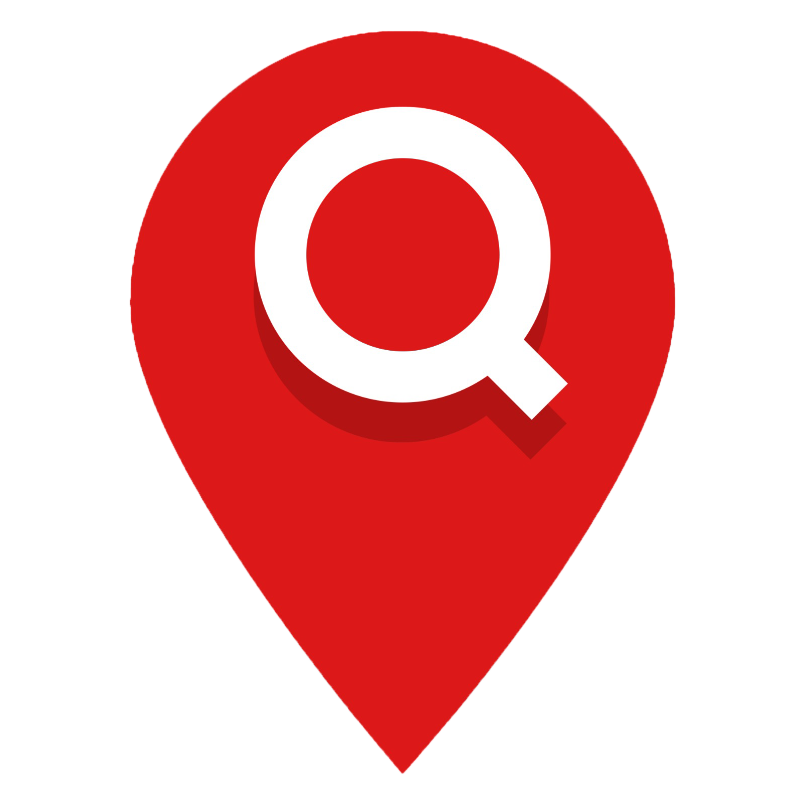

  

## 
Q - Your Ultimate Grocery Shopping Companion 🛒

Welcome to the exciting world of Q, your trusted companion for efficient grocery shopping adventures! Developed during a thrilling 24-hour hackathon, Q is here to revolutionize your shopping experience, helping you save both time and money. Let's dive in and explore the amazing features of this app!

📦 Load Up Your Cart, Smart Shopper! 📦

With Q, you can effortlessly add your desired grocery products to your virtual cart. Say goodbye to juggling paper lists or forgetting items. Q keeps track of your shopping needs, making sure you never miss an essential item.

  

💰 Find the Best Deals, Watch Your Savings Grow 💰

Q goes the extra mile by comparing prices at multiple markets in your area. Want the best bang for your buck? Q's got your back! It shows you the value of your cart at various local markets, enabling you to choose the one with the most affordable prices. Your wallet will thank you!

  

📍 Discover Stores Like Never Before 📍

When you select a market, Q unveils a world of information beyond just prices. Get ready to make informed decisions! Q displays not only the total price but also the store's address. And that's not all! Q features an icon system that suggests how busy the store is. No more wasting time in long Queues. Q estimates how long your shopping trip might take, empowering you to plan your day with ease.

  

📍🚗 GPS Guidance Made Easy 🚗📍

Q takes convenience to the next level. Once you've loaded up your cart and selected your desired store, Q offers two fantastic options. Need directions? Simply tap the GPS pin, and voila! Q instantly opens Google Maps or Waze, guiding you straight to the store's location. No more wrong turns or driving in circles—Q gets you there hassle-free.

  
  

🗺️ Find Your Path, Super Shopper 🗺️

Ever wished you could navigate the store like a pro? Well, now you can with Q's "Ruta" feature! Tap the "Ruta" button, and Q reveals the optimal path for grabbing all your items in the fastest way possible. Say goodbye to wandering aimlessly through aisles. Q unlocks the secrets to efficient shopping, making you a true master of the grocery store maze.

  

⏱️ Save Time, Save Money, Shop with Q! ⏱️

Q is your ultimate time and money-saving companion for grocery shopping. With its intuitive features and smart suggestions, Q transforms your shopping routine into an enjoyable and efficient experience. Say goodbye to wasted time and unnecessary expenses. Embrace the power of Q, and become the savvy shopper you were meant to be!

🚀 Happy Shopping with Q! 🚀
